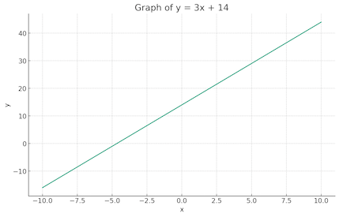

# How to use Assistants

> [!WARNING]  
> The Assistants API is still in Beta. Specifications, usage, and parameters are subject to change without announcement.

The Assistants API allows you to build AI assistants within your own applications. An Assistant has instructions and can leverage models, tools, and knowledge to respond to user queries. The Assistants API supports three types of tools: Code Interpreter, Retrieval, and Function calling.

OpenAI's official document is here.  
https://platform.openai.com/docs/assistants/overview

PSOpenAI PowerShell module includes various cmdlets for using the Assistants API through PowerShell friendly style especially pipeline input / output.

This guide describes how to use Assistants step-by-step.

## Step 1: Create an Assistant

Assistant is an object that specifies the behavior of the AI model. It includes parameters like the AI model to use, custom instructions, applicable tools, and a reference list of files.

In this example, create an assistant to indicate a math teacher. Use GPT-3.5 model and allow the use of Code Interpreter tool.

Use the `New-Assistant` cmdlet to create an Assistant.

```PowerShell
# Import PSOpenAI module and Set API key.
Import-Module ..\PSOpenAI.psd1 -Force
$env:OPENAI_API_KEY = '<Put your API key here>'

# Create an Assistant
$Assistant = New-Assistant `
    -Name "Math Teacher" `
    -Model "gpt-3.5-turbo-0613" `
    -UseCodeInterpreter `
    -Instructions "You are a personal math tutor. Write and run code to answer math questions."
```

## Step 2: Create a Thread and Add a Message.

A Thread represents a conversation. It keeps a history of interactions, aiding in contextual AI communication.

To begin interacting with AI using the Assistant API, start by creating a new Thread object and adding your first message to it.

For this step, use `New-Thread` and `Add-ThreadMessage` cmdlets.

```PowerShell
# Create a Thread
$Thread = New-Thread

# Add a first Message to the Thread
$Thread = $Thread | Add-ThreadMessage `
    -Message "Please make a graph of y=3x+14 and output it as a PNG image." `
    -PassThru
```

## Step 3: Run the Assistant with Thread.

For the AI model to respond to user messages, create a Run by associating an Assistant with a Thread. The Assistant reads Thread's messages and runs tools such as Code Interpreter if necessary to create a response.

If the term 'Run' seems confusing, you can think of it as a 'Job'. PSOpenAI handles 'Run' similarly to PowerShell's Job cmdlets.

To create (start) a Run, use the `Start-ThreadRun` cmdlet.

```PowerShell
# Start a run
$Run = Start-ThreadRun -Thread $Thread -Assistant $Assistant
```

`Start-ThreadRun` only starts a Run and does not wait for it to complete. The status of the created Run object shows that it is "Queued".

```PowerShell
# Displays the run object
id           : run_01234
object       : thread.run
assistant_id : asst_0000abc
thread_id    : thread_0000def
status       : queued
created_at   : 2023/11/18 12:00:00
started_at   : 2023/11/18 12:00:00
completed_at : 
```


## Step 4: Wait the Run completion and Receive result.

You need to wait until the status of the Run is completed. The time it takes to execute the Run is not constant. It varies depending on the content of the instructions and the load status of OpenAI.

`Wait-ThreadRun` can be used to wait for the Run to complete.

```PowerShell
# Wait for completion
$Run = $Run | Wait-ThreadRun

# Confirm that the Run completed.
$Run.status  # -> "completed"
```

When the Run completes, the response is added to the Thread message. To retrieve it, use `Receive-ThreadRun`. This cmdlet returns an updated Thread object.

```PowerShell
# Receive updated Thread object
$Thread = $Run | Receive-ThreadRun
```

## Step 5: Displays the Assistant's Response

You can retrive the contents of all messages in a Thread by referring to the `Messages` property of the Thread object.

The Message object has many properties, so if you want to display just the message content in a simple and easy-to-read way, It's a good to refer to the `SimpleContent` property.

```PowerShell
# Display messages as read suitable
$Thread.Messages.SimpleContent

Role      Type       Content
----      ----       -------
user      text       Please make a graph of y=3x+14 and output it as a PNG image.
assistant image_file file-rApGDzYB4Kop2piAhFfzbrxT
assistant text       Here is the graph of the equation y = 3x + 14:
                     
```

## Step 6: Save files generated by Assistant.

Depending on your instructions to the Assistant, the AI model will create a file in addition to a text response. When the Message in the Thread contains the ID of file, so use the `Get-OpenAIFileContent` to download it.

```PowerShell
# Download generated file.
Get-OpenAIFileContent -Id "file-rApGDzYB4Kop2piAhFfzbrxT" -OutFile "C:\data\graph.png"
```




## Step 7: Check step details.

If you want to see more details about what Assistant did internally to create the message, use `Get-ThreadRunStep` to get the Step object.

```PowerShell
# Get Steps
$Steps = $Run | Get-ThreadRunStep

# Displays Steps
$Steps | Format-Table 'id', 'type', 'completed_at'

id              type              completed_at
--              ----              ------------
step_6PWX9...   tool_calls        2023/11/18 12:01:24
step_vGLIO...   message_creation  2023/11/23 12:01:27
```

If you look at the Step of type `tool_calls`, you can see the Python code that the Assistant executed in the code interpreter.

```PowerShell
# Extract the code that was executed in the Code Interpreter
$Steps[0].SimpleContent.Content
```
```python
import numpy as np
import matplotlib.pyplot as plt

x = np.linspace(-10, 10, 100)
y = 3*x + 14

plt.plot(x, y)
plt.xlabel('x')
plt.ylabel('y')
plt.title('Graph of y = 3x + 14')
plt.grid(True)
plt.savefig('/mnt/data/graph.png', format='png')
plt.show()
```

## Step 8: Remove Thread and Assitant.

Threads and Assiatants can be deleted if they are no longer used.

Use `Remove-Thread` and `Remove-Assistant`.

```PowerShell
# Remove a Thread
$Thread | Remove-Thread

# Remove an Assistant
$Assistant | Remove-Assistant
```


## Additional Tips: Use more pipelines.

The process described in this guide can be simplified using pipelines.

```PowerShell
# Create a new Assistant
$Assistant = New-Assistant -Model "gpt-3.5-turbo"

# Create a Thread and add a Message, then starts Run and receive the result when completes the Run.
$Result = New-Thread |`
           Add-ThreadMessage "Hello, what can you do for me?" -PassThru | `
            Start-ThreadRun -Assistant $Assistant |`
             Receive-ThreadRun -Wait

# Dislpays only Assistant response message
$Result.Messages.SimpleContent[-1].Content

Hello! I'm an AI assistant trained to provide information and assist with...
```
