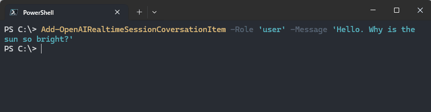

# How to use Realtime API

The Realtime API enables you to communicate with a GPT model live, in real time experiences.  

OpenAI's official guide is here.  
https://platform.openai.com/docs/guides/realtime

PSOpenAI provides the ability to use the Realtime API in an event-based style through PowerShell.

## Basics

### Step 1: Subscribe events

PSOpenAI notifies messages received from the server in real time as events.

You can subscribe to the events you are interested in using `Register-EngineEvent` and specify the action to be taken when you receive them.

```powershell
# SourceIdentifier is always "PSOpenAI.Realtime.ReceiveMessage"
Register-EngineEvent -SourceIdentifier "PSOpenAI.Realtime.ReceiveMessage" -Action {
    $eventItem = $Event.SourceArgs[0]
    switch ($eventItem.type) {
        'session.created'
        {
            # Display session info
            Write-Host "`r"
            ('Connected. (SessionID = "{0}")' -f $eventItem.session.id) | Write-Host -ForegroundColor Green
        }
        'response.output_text.delta'
        {
            # Display text responses from the AI to the console
            $eventItem.delta | Write-Host -NoNewline -ForegroundColor Blue
        }
        'error'
        {
            # Oops, something went wrong.
            Write-Host "`r"
            ('ERROR : "{0}")' -f $eventItem.error.message) | Write-Host -ForegroundColor Red
        }
    }
}
```

There are various types that can be received. All are listed in the [OpenAI reference](https://platform.openai.com/docs/api-reference/realtime-server-events), but here are a few that may be of particular interest to you

- `error`
- `session.created`
- `session.updated`
- `response.done`
- `response.output_text.delta`
- `response.output_text.done`


### Step 2: Connect & configure session

You need to connect to a session for conversation.

```powershell
# Import PSOpenAI module and Set API key.
Import-Module ..\PSOpenAI.psd1 -Force
$env:OPENAI_API_KEY = '<Put your API key here>'

# Connect to a session
Connect-RealtimeSession
```

Then, configure session settings as needed.
```powershell
# Configure system message, output type, etc.
Set-RealtimeSessionConfiguration `
    -Modalities 'text' `
    -Instructions 'You are a assistant for children. Always choose words that are easy for the child to understand.' `
    -Temperature 0.6
```

### Step 3: Send messages

You can add as many messages as you need to the session.  
In turn-based dialogue mode, the AI will not start generating answers once you have added messages.

```powershell
Add-RealtimeSessionItem `
  -Role 'user' `
  -Message 'Hello. Why is the sun so bright?'
```

After adding messages, request the AI to generate an answer.

```powershell
Request-RealtimeSessionResponse
```

Since we configured the output AI response events in blue in Step 1, blue text will be displayed on the console.



Repeat this step if you wish to continue the dialogue.

```powershell
Add-RealtimeSessionItem `
  -Role 'user' `
  -Message "Hmmm, I'm not understanding. Explain it more simply."

Request-RealtimeSessionResponse
```

### Final Step: Close session

Finally, close the session when the conversation is over.

```powershell
Disconnect-RealtimeSession
```

> [!NOTE]  
> Session may end unexpectedly in the middle of a conversation due to timeouts, network errors, etc.  
> Even in such cases, you should always do this.

(Optional) Stop event subscribe if not needed.

```powershell
Unregister-Event -SourceIdentifier "PSOpenAI.Realtime.ReceiveMessage"
```

## Mic-In / Speaker-Out

> [!IMPORTANT]  
> Mic-In and Speaker-Out features are only works on **Windows** with **PowerShell 7.4+**.  
> Other platforms, such as Linux can not use these functions.

PSOpenAI has helper functions to capture audio from the microphone and output the server's response to the speaker device.

- Start-RealtimeSessionAudioInput
- Stop-RealtimeSessionAudioInput
- Start-RealtimeSessionAudioOutput
- Stop-RealtimeSessionAudioOutput

These funcrions enables real-time conversations with the AI using the PowerShell console.

### Sample script

This is a sample script that connect to a real-time session, configures the server's voice response to be enabled, and then starts speaker output and microphone input.

By enabling automatic turn detection, the response is initiated at the server's decision without a need to manually run `Request-RealtimeSessionResponse`.

```powershell
$env:OPENAI_API_KEY = '<Put your API key here>'

# Connect to a session.
Connect-RealtimeSession

# Enables audio response with automatic turn detection.
Set-RealtimeSessionConfiguration -Modalities audio -EnableTurnDetection $true

# Activates speaker output.
Start-RealtimeSessionAudioOutput

# Activates capture audio from the mic.
Start-RealtimeSessionAudioInput

Write-Host 'Now you can talk with the assistants in realtime.'
```

Once microphone input is activated, all audio from the microphone is sent to the server.

Never forget to stop the microphone input and end the session when you are satisfied with conversation with the assistant.

```powershell
# Deactivates speaker output.
Stop-RealtimeSessionAudioOutput

# Deactivates mic in.
Stop-RealtimeSessionAudioInput

# Disconnect from the session.
Disconnect-RealtimeSession
```
